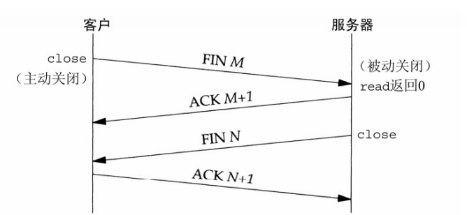

## 概述

TCP 传输控制协议（Transmission Control Protocol）。TCP是一个面向连接的协议，为用户进程提供可靠的全双工字节流。TCP套接字是一种流套接字（stream socket）。TCP关心确认、超时和重传之类的细节。
UDP 用户数据报协议（User Datagram Protocol）。UDP是一个无连接协议。UDP套接字是一种数据报套接字（datagram socket）。UDP数据报不能保证最终到达它们的目的地，不保证各个数据报的先后顺序跨网络后保持不变，也不保证每个数据报只到达一次。

### TCP

-TCP与UDP不同，TCP首先需要建立链接；
-TCP提供了可靠性，当TCP向另一端发送数据时，他要求对端返回一个确认，如果没有收到确认，TCP就自动重传数据并等待更长时间。在数次重传失败后，TCP才放弃。
TCP通过给其中每个字节关联一个序列号对所发送的数据进行排序（sequencing）。接收端会根据序号来对数据进行重新排序。
-TCP提供流量控制（flow control）。TCP总是告知对端在任何时刻它一次能够从对端接收多少字节的数据，这称为通告窗口（advertised window）。在任何时刻，该窗口指出接收缓冲区中当前可用的空间量，从而确保发送端发送的数据不会使接收缓冲区溢出。该窗口时刻动态变化：当接收到来自发送端的数据时，窗口大小就减小，但是当接收端应用从缓冲区中读取数据时，窗口大小就增大。

#### 三次握手

-服务器必须准备好接受外来连接，通过调用socket、bind和listen完成；
-客户端通过connect发起主动打开，这回使得客户TCP发送一个SYN（同步）分节告诉服务器将在（待建立的）连接中发送的数据的初始序列号。通常SYN分节不携带数据，其所在IP数据报只含有一个IP首部、一个TCP首部及可能有的TCP选项；
-服务器必须确认（ACK）客户的SYN，同时自己也得发送一个SYN分节，它含有服务器将在同一连接中发送的数据的初始序列号。服务器在单个分节中发送SYN和对客户SYN的ACK（确认）；
-客户必须确认服务器的SYN。
这种交换至少需要3个分组，因此称之为TCP的三路握手

#### 四次挥手

TCP建立一个连接需3个分节，终止一个连接则需4个分节。
-某个应用进程首先调用close，我们称该端执行主动关闭（active close）。该端的TCP于是发送一个FIN分节，表示数据发送完毕。
-接收到这个FIN的对端执行被动关闭（passive close）。这个FIN由TCP确认。它的接收也作为一个文件结束符（end-of-file）传递给接收端应用进程（放在已排队等候该应用进程接收的任何其他数据之后），因为FIN的接收意味着接收端应用进程在相应连接上再无额外数据可接收。
-一段时间后，接收到这个文件结束符的应用进程将调用close关闭它的套接字。这导致它的TCP也发送一个FIN。
-接收这个最终FIN的原发送端TCP（即执行主动关闭的那一端）确认这个FIN。

### SCTP

SCTP在客户和服务器之间提供关联（association），并像TCP那样给应用提供可靠性、排序、流量控制以及全双工的数据传送。一个关联指代两个系统之间的一次通信，它可能因为SCTP支持多宿而涉及不止两个地址。
-SCTP面向消息，支持按序递送。
-SCTP能够在所连接的端点之间提供多个流，每个流各自可靠地按序递送消息。
-SCTP还提供多宿特性，使得单个SCTP端点能够支持多个IP地址。